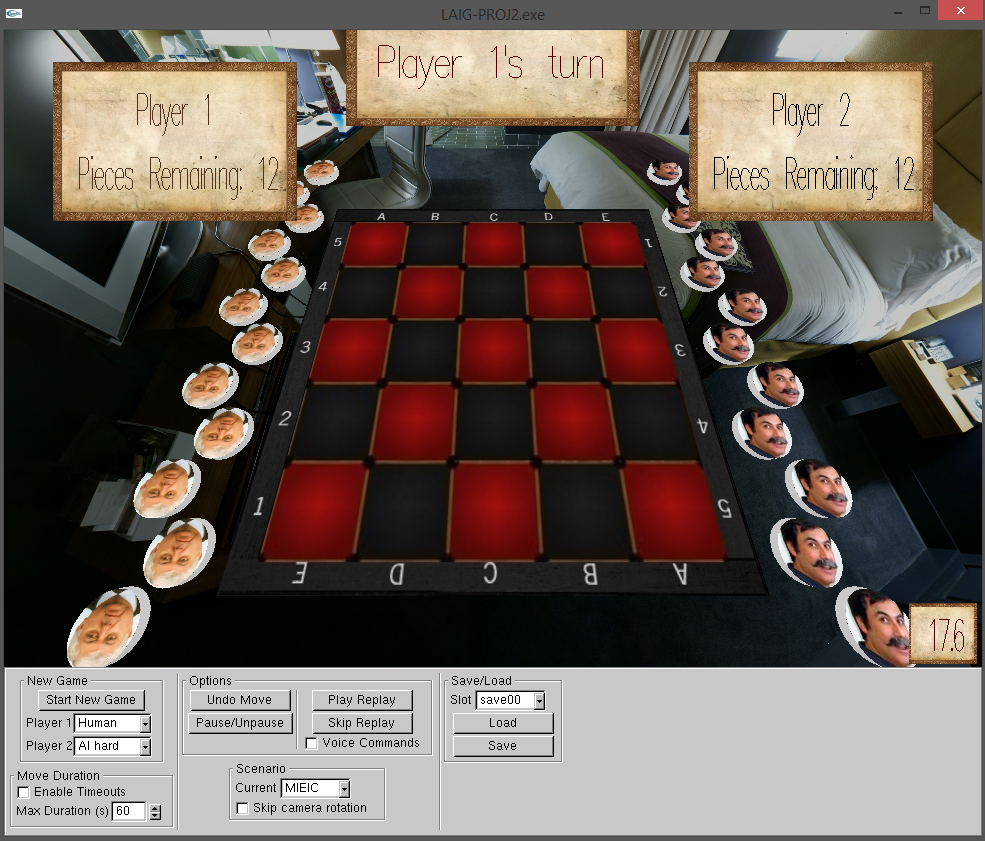
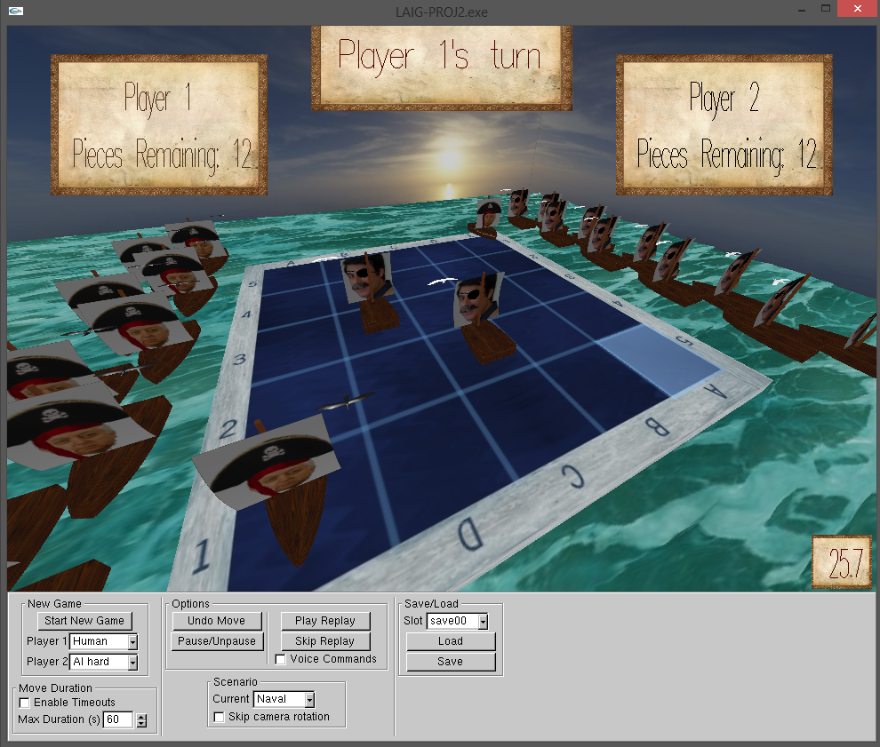
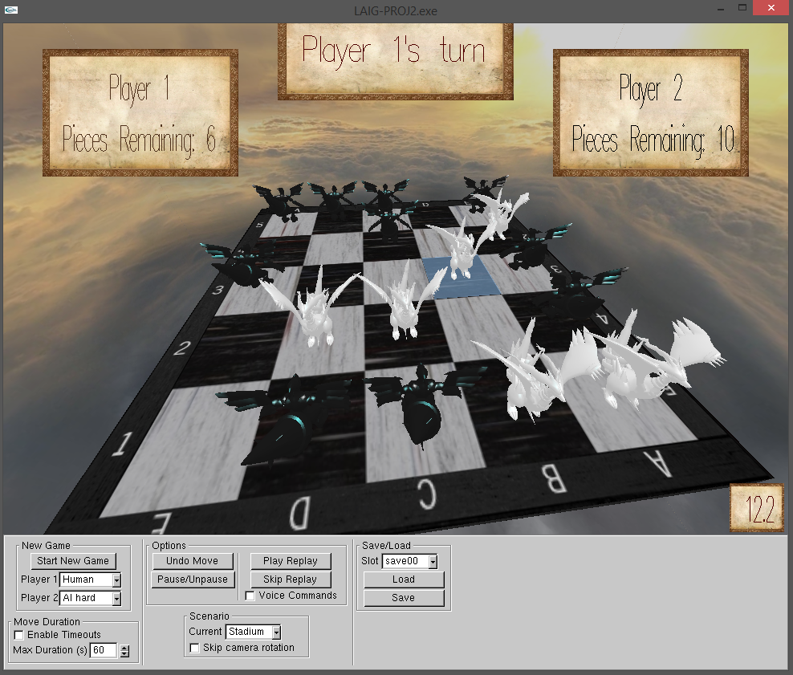
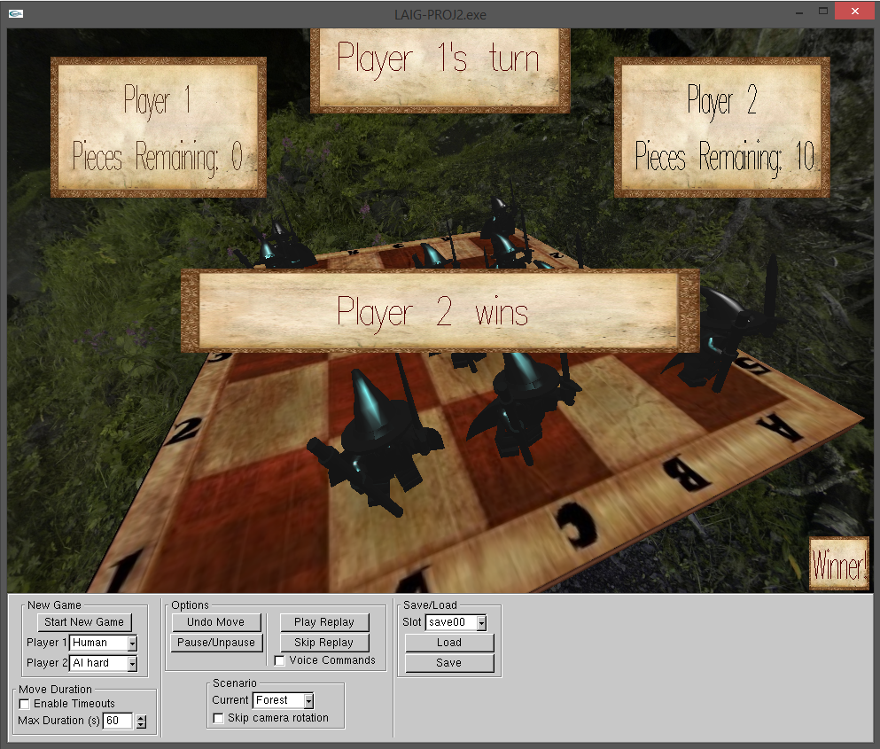

Choko 3D
===============================

An implementation of the board game Choko using OpenGL and GLUI for the 3d interface as well as the VOCE library for voice control. The game logic and AI were programmed separately using Prolog (choko.exe). The communication between the Prolog logic and the interface layers is done via sockets.

For information on how to play Choko see: http://en.wikipedia.org/wiki/Choko_%28game%29

To run the program (LAIG-PROJ2.exe) you may need to add the jvm.dll to your path (It's usually in C:\Program Files (x86)\Java\jdk1.x.x_xx\jre\bin\client). 
Additionally, to compile the program, you might also need to add the paths for the "include" folder and the "win32" folder within (these are also in the jdk folder) as well as add jvm.lib as an Additional Dependency.

Screenshots
============

Instructions
============

For rules on how to play Choko see the link mentioned above.

The interface follows an approach similar to classic computer games such as minesweeper or freecell in which the game starts with default configuration values to avoid complicated and annoying menus. At any time the player can change these values and, if they want to, reset the game. Otherwise, the changes will affect the ongoing game.

Available options:

    - Start a new game
    - Change player type (Either player can be human or an AI of any 3 difficulties: easy, medium and hard)
    - Activate and specify maximum duration for player moves
    - Undo moves
    - Pause/resume
    - Watch a replay of the game so far
    - Skip a replay to the end
    - Change the game's theme (appearance)
    - Skip camera rotation animations
    - Save/Load a game
    - Check the HUD for information on the current game (whose turn is it, number of pieces of each player still on the board, time elapsed since turn began and some other information such as game paused or game over)
    
Voice Control
=============

For controlling a player's turn with voice controls, a player must first activate the option to allow voice control. The voice commands allowed are:

    - move piece from <column> <row> to <column> <row>
    - drop piece on <column> <row>
    - remove piece on <column> <row>
    
&lt;column&gt;'s are identified by a letter (as seen on the board) and the user can either say the letter (a, b, c, d, e) or use the NATO phonetic alphabet (alpha, bravo, charlie, delta, echo). It is recommended to use the latter alternative as the VOCE library has an easier time identifying the sounds.

&lt;row&gt;'s are identified by a number from 1 to 5 (as seen on the board).
